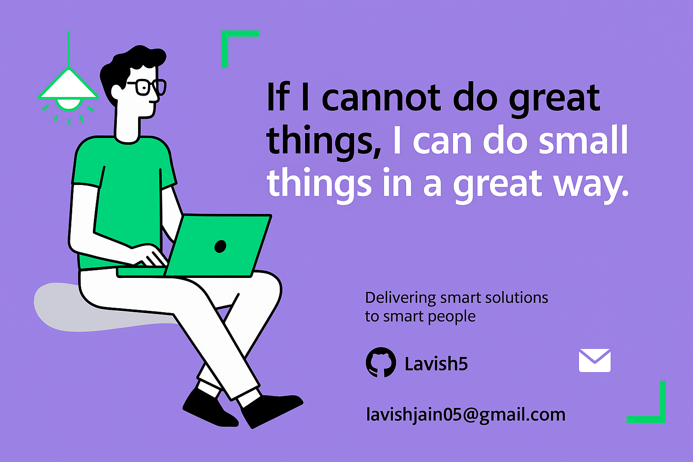

<h1 align="center">Hello I'm Lavish Jain</h1>

<!--
**soumyajit4419/soumyajit4419** is a ✨ _special_ ✨ repository because its `README.md` (this file) appears on your GitHub profile.
Here are some ideas to get you started: -->

  
  

  

## 👨🏻‍💻 About Me:

- 🙋‍♂️ All about me is at **[My Website](https://lavish-tech.vercel.app/)**

- 🔭 I’m currently working on building scalable data pipelines and analytics solutions.

- 🌱 I’m currently learning more about cloud data platforms, distributed processing, and modern data engineering practices.

- 👯 I’m looking to collaborate on `Data Engineering`, `ETL/ELT`, and `Analytics Engineering` projects.

- 🤔 I’m improving my problem-solving skills through `Competitive Programming`.

- 💬 Ask me about `Python`, `SQL`, `PySpark`, `Snowflake`, `dbt`, and data workflows.

- 👨‍💻 Life Hack: Learn new tech, build with it, and share what you learn.

- ⚡ Fun fact: I waste most of my time playing games.

## 🛠️ Technologies and Tools I use:

### Languages

### Data Engineering & Analytics

### Tools & Platforms

## ❤️ Let's get connected:

   

